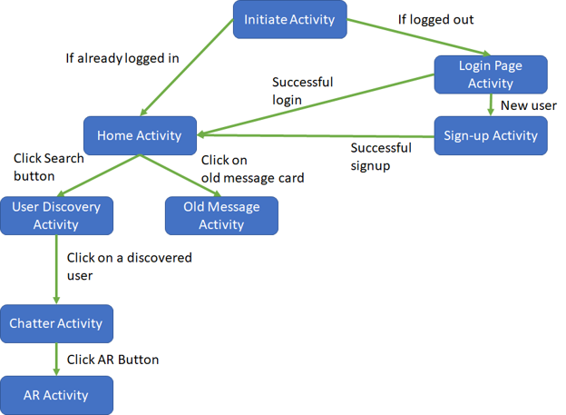

# I'm Here Android Application

      
I'm Here Android application uses Wi-Fi Direct and Augmented Reality to allow offline communication between Wi-Fi enabled Android devices in the absence of internet access through cellular or Wi-Fi access points. Augmented Reality allows you to locate your friends without the use of internet or offline maps! Imagine communicating with your friends on a hike, or while skiing, or locating them in a forest or at the beach. All possible with the I'm Here app.

## Getting Started

The build folder includes the signed .apk file. You can sideload the app by copying the file to your phone and installing it. Please ensure to allow apps from "Unknown Sources" for a successful installation.

To access the Unknown Sources setting directly, press the menu icon or button from the Home screen and tap Settings. Select Security (Android OS 4.0+) or Applications (Android OS 3.0 and earlier). You may need to scroll down to see the Unknown Sources setting. For Android 8.0+, tap Settings, then tap Apps. Next, select "I'm Here," then tap Install unknown apps and toggle "Allow from this source."

### Prerequisites

Android Smartphone with Android 8.0+ (API level 26).

### Application Structure


For details on all the activities, please read the [Project Report](CMPE_277_Project_Report_ I'm_Here.pdf).

### Installing

A step by step series of examples that tell you how to get a development env running

Say what the step will be

```
Give the example
```

And repeat

```
until finished
```

End with an example of getting some data out of the system or using it for a little demo

## Running the tests

Explain how to run the automated tests for this system

### Break down into end to end tests

Explain what these tests test and why

```
Give an example
```

### And coding style tests

Explain what these tests test and why

```
Give an example
```

## Built With

* Android Studio

## Contributors

* **Deepak Talwar** - (https://github.com/deepaktalwardt)
* **Chen-Feng Huang** - (https://github.com/chuang5)
* **Donghao Su** - (https://github.com/donghaosu)

## Acknowledgments

* This application was originally developed for the course CMPE 277 - Fall 2018 : Smartphone Application Development at San Jose State University. 
* Thanks to Qin Bian (https://github.com/QinBian) for designing the awesome logo for the app, and providing advice for the app UI.
